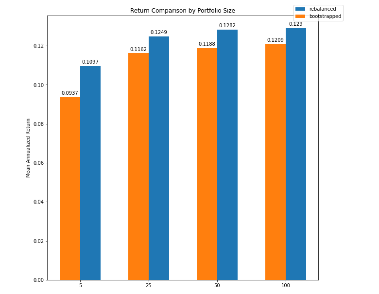
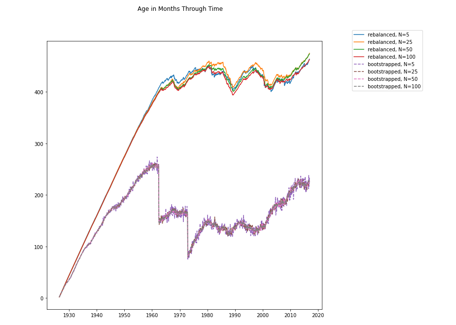
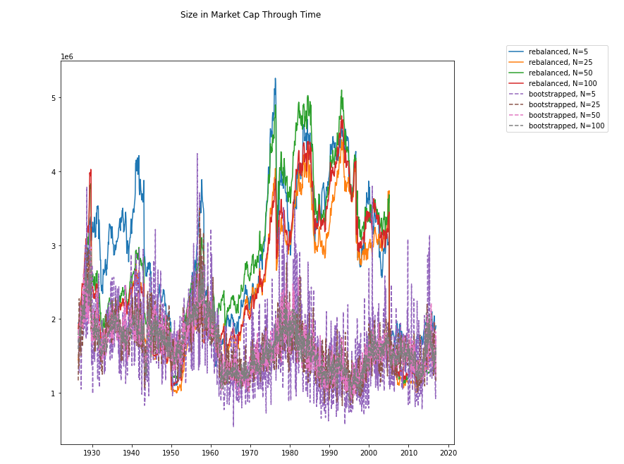

# portfolio_simulation
Using the Wharton CRSP historical stock return database and python to replicate and generate further insights to the findings in the paper "Age Matters": https://papers.ssrn.com/sol3/papers.cfm?abstract_id=3363360

See the jupyter notebook for my preliminary findings when working as an undergraduate researcher on this topic. There were further findings which I have not included in this repo. 

Two types of portfolios were constructed and evaluated from 1926-2016

# Rebalanced Portfolio
In the beginning N stocks are selected with equal weights. After each month the stocks are rebalanced so that equal weighting is maintained. This means if the stock appreciated in value, it must be sold in order to get back to its proper equal weighting.

# Bootstrapped Portfolio
Quite simply N new stocks are chosen each month.

# Creating an Indexed Matrix to extract key variables
Given the size of the CRSP data, it became necessary to create data structures to access the required variables quickly when simulating

In order to maximize efficiency when simulating, a 2-D return matrix was created. The indices were the PERMNO (unique identifier) of the stock, and the columns are the dates. If the stock is available the its return value will be in the cell, if it is not available then the cell value will be nan. In order to get all of the returns of a group of PERMNO's in a given month, one can simply use fancy pandas indexing through full_ret_max[listofPermnos][date]. This will give the required returns very quickly.

Other matrices, such as an age matrix and a size matrix were created to extract other variables in a quick fashion.

Additionally a listofavailable dict was created, where the key is the date, and the value is the list of PERMNO's available at that date. This made sampling from the dataset very efficient.

# Annualized Return Comparison

The rebalanced portfolio clearly outperforms the bootstrapped portfolio across 1000 simulations at 4 different portfolio sizes. The higher the portfolio size, the better the return due to the effects of diversification of risks. Cool!

# Age and Size Comparison

The rebalanced portfolio evidently is older than the bootstrapped portfolio, as stocks are held instead of being swapped monthly. The bootstrapped portfolio represents the average age of the entire universe of stocks.

The rebalanced portfolio generally contains larger stocks than the bootstrapped one. However the difference is not as pronounced, particularly after 2008 when they are relatively even.

# Conclusion
The results of the paper can be replicated. It is quite clear that the rebalanced strategy is superior. It is most likely that this is due to age, but further work should be done to confirm this. 

